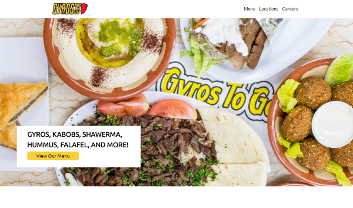

# Restaurant Website

I updated a local restaurant website that is outdated into an modern styled website to implent the skills I have been learning. This was a fun experience bringing life to the website. Customers will be able to navigate easily and quicly through the website with great readability, from reading the menu to finding a near location. I learned to implement HTML, Bootstrap, CSS, and JAVASCRIPT making me well versed in them. 

## Credits:

https://getbootstrap.com/
https://fontawesome.com/
https://fonts.google.com/
https://www.udemy.com/
